# CampusManagerPro

A homework platform for schools. Teachers create classes, post assignments and grade student work. Students join classes with a code, upload their solutions from a dashboard and track their grades.

## Features

**Teachers**
- Create classes, each with a shareable join code (copy it or generate a new one)
- Post assignments with instructions, due date, points, a late-work policy and an optional file attachment
- See who has turned work in, filter by *to grade / graded / not turned in*, read answers and download uploaded files
- Grade with a score and written feedback, or return a graded submission so the student can resubmit
- Class gradebook with per-student totals, letter grades and assignment averages, exportable to CSV
- Post class announcements and manage the student roster
- Dashboard showing submissions waiting to be graded and upcoming deadlines

**Students**
- Join classes with a code
- Submit a typed answer, a file (PDF, Word, images, ZIP, code and more), or both
- Edit, resubmit or withdraw work until it is graded. Work turned in after the due date is marked late, and blocked if the teacher turned off late work
- See score, percentage, letter grade and teacher feedback
- "My Grades" page with per-class and overall averages
- Dashboard with a to-do list, missing work and recent grades

**Grading scale:** A ≥ 90%, B ≥ 80%, C ≥ 70%, D ≥ 60%, F < 60%. Totals are weighted by points and use graded work only.

## Screenshots

### Sign in and registration

| Login | Register |
|-------|----------|
| 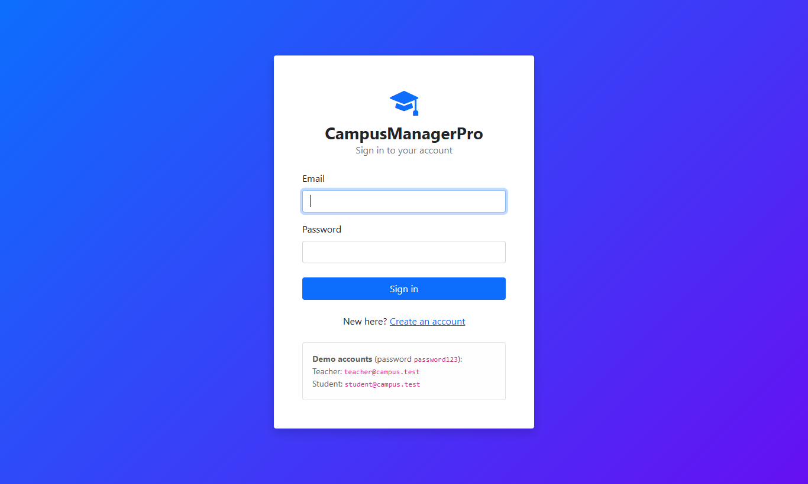 | 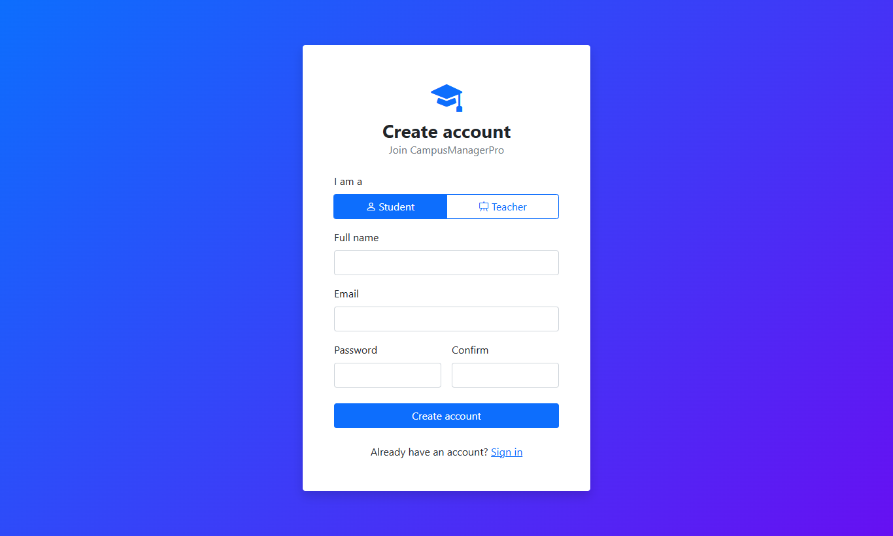 |

### Teacher

**Dashboard.** Submissions waiting to be graded, upcoming deadlines and how many students have turned each one in.

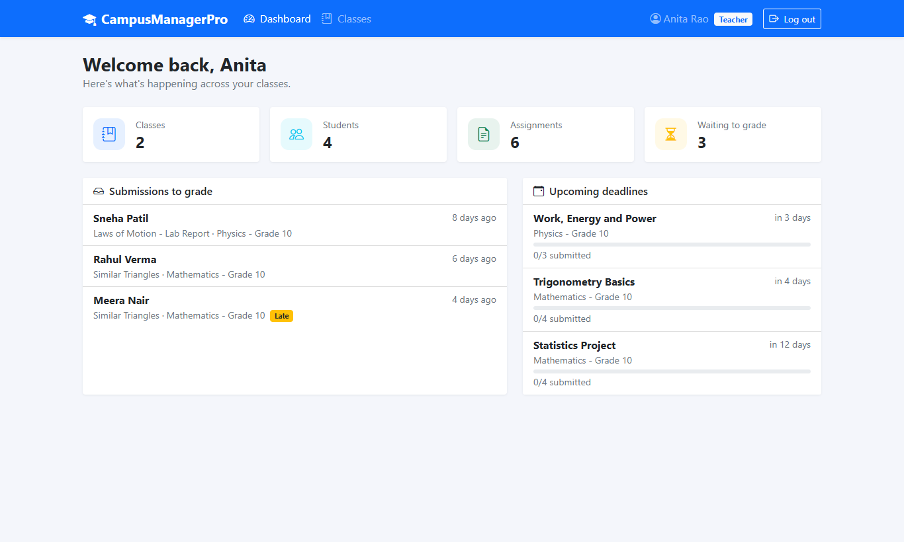

**Classes.** Each class card shows its join code, student count and assignment count.

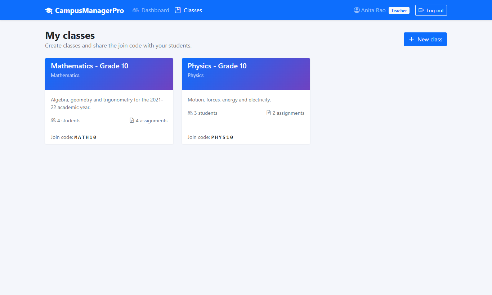

**Class page.** Assignments with turned-in and graded counts. The join code can be copied or regenerated from the header.

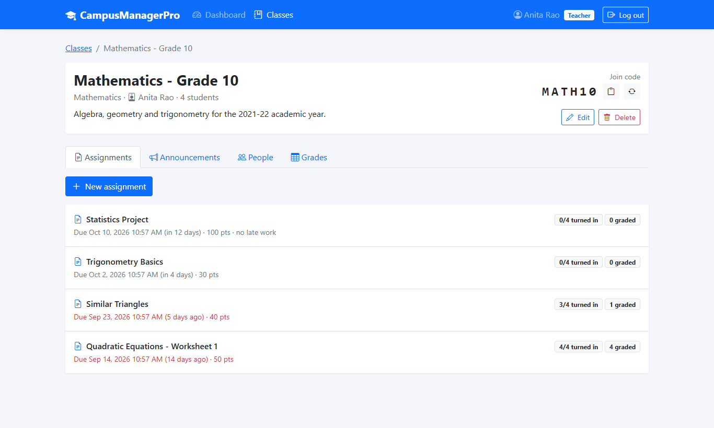

**Creating an assignment.** Instructions, due date, points, late-work switch and an optional attachment.

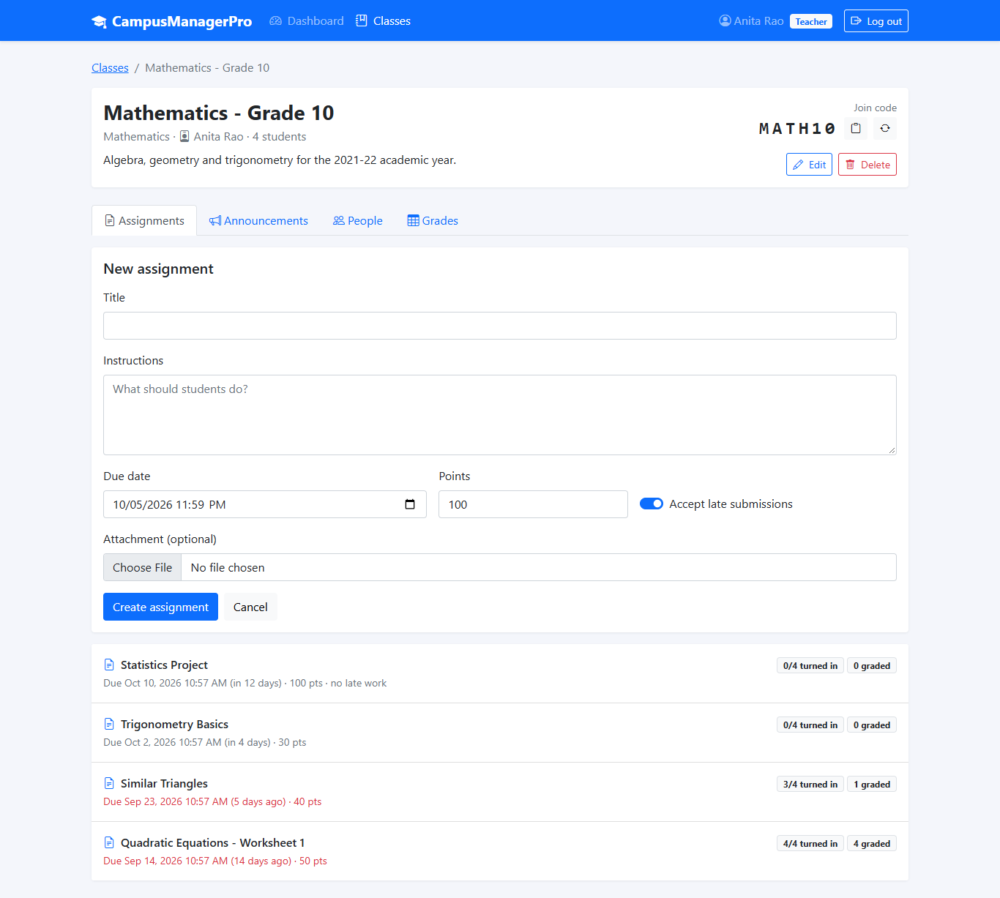

**Grading.** Every enrolled student is listed with their status. Opening a submission shows the answer and any uploaded file next to the score and feedback form. Filters: to grade, graded, not turned in.

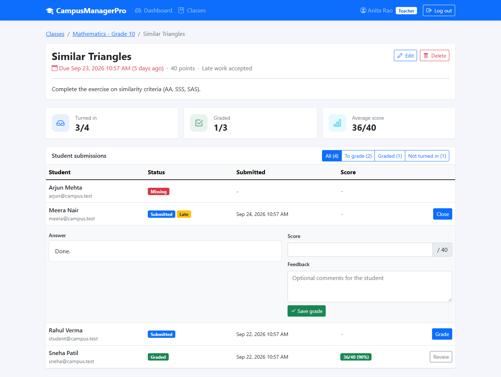

**Gradebook.** Scores for every student and assignment, missing and late work flagged, class averages per assignment, CSV export.

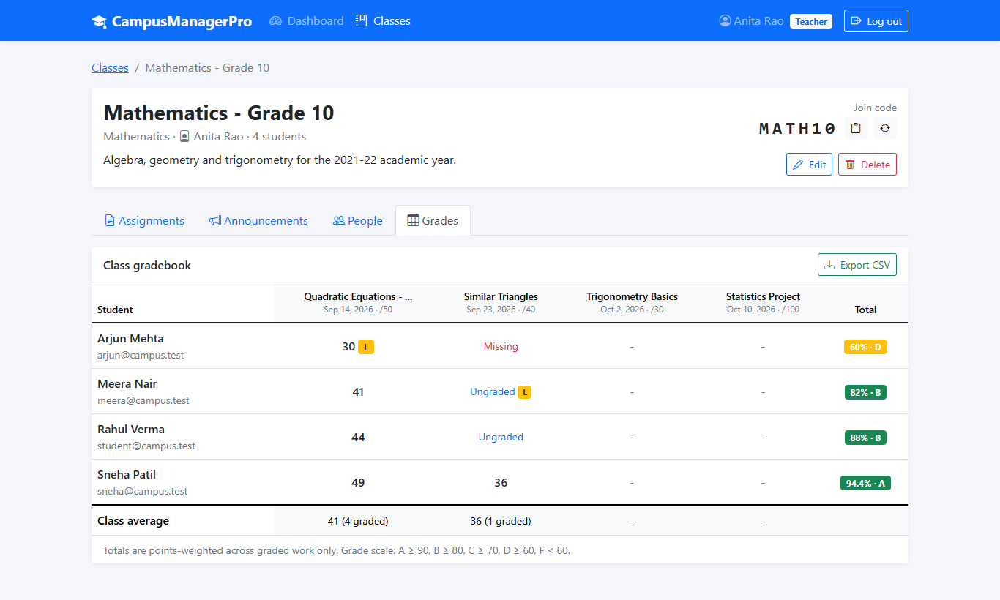

| Announcements | People |
|---------------|--------|
| 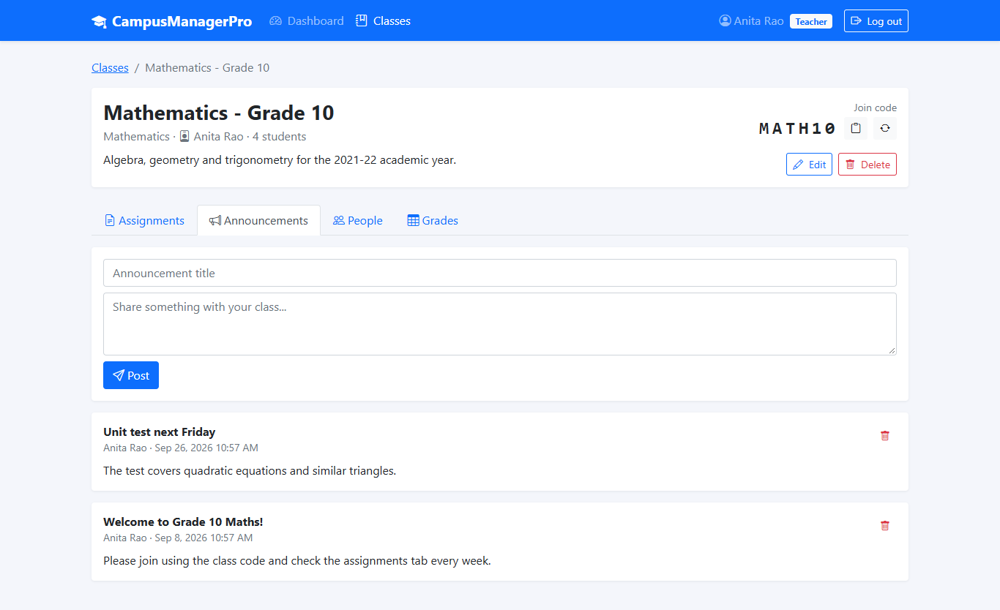 | 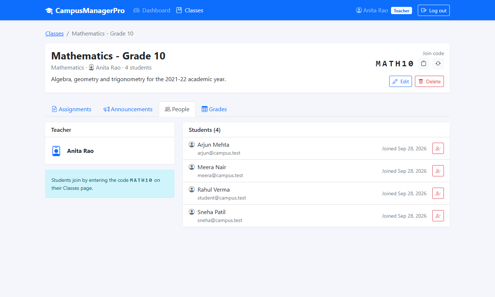 |

### Student

**Dashboard.** To-do list sorted by due date, missing work count, overall grade and recent feedback.

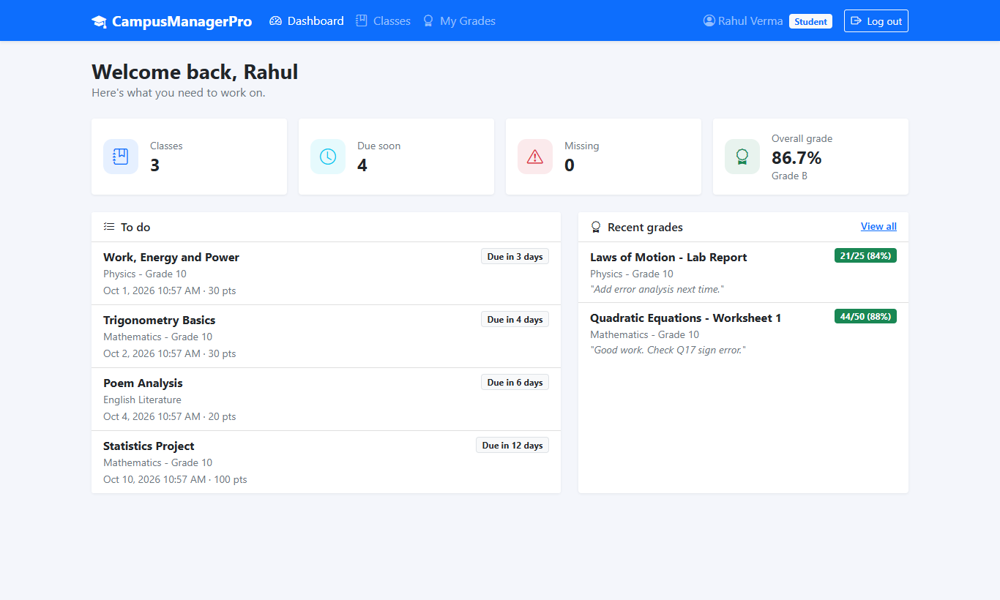

**Joining a class.** Enter the teacher's code to enroll.

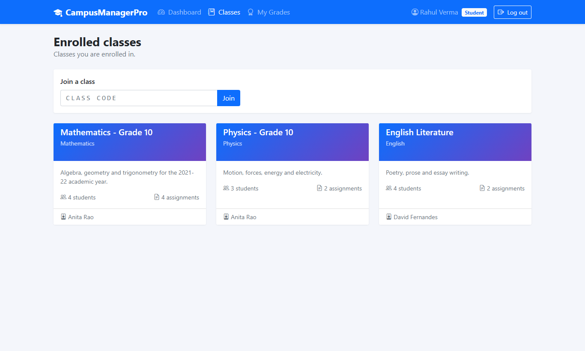

**Submitting homework.** Type an answer, attach a file, or both. Work can be edited or withdrawn until it is graded.

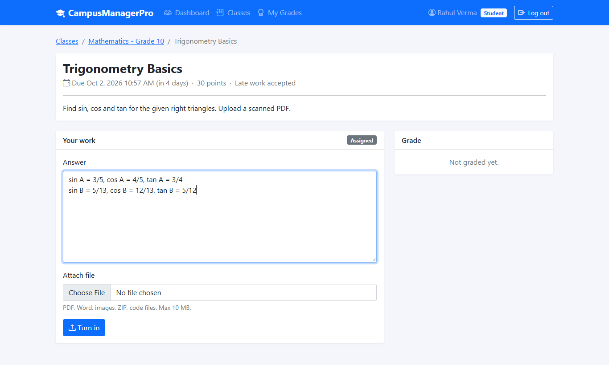

**Viewing a grade.** Score, percentage, letter grade and the teacher's feedback.

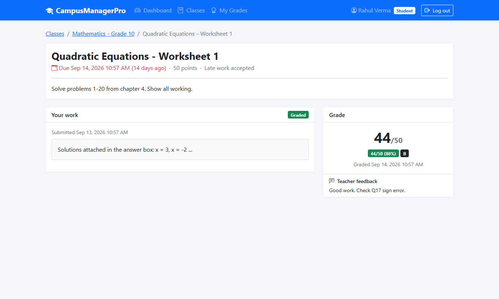

**My Grades.** Every assignment across all classes with per-class and overall averages.

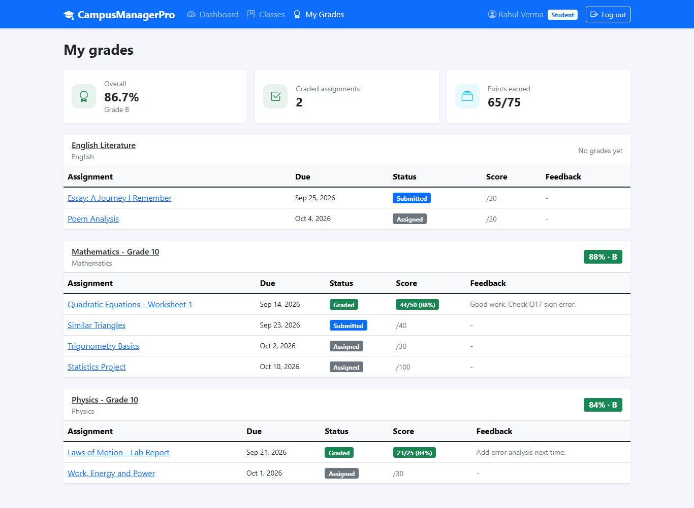

## Tech stack

| Layer    | Technology |
|----------|------------|
| Frontend | React 17.0.2, Create React App 5.0.0, React Router 6.2.1, Axios 0.24, Bootstrap 5.1.3, Bootstrap Icons 1.7.2, Day.js 1.10.7, React-Toastify 8.1 |
| Backend  | Node.js 16 LTS, Express 4.17.2, node-postgres (pg) 8.7.1, JSON Web Tokens 8.5.1, bcryptjs 2.4.3, Multer 1.4.4, Helmet 4.6 |
| Database | PostgreSQL 14 |

## Project structure

```
CampusManagerPro/
├── client/                    React front end
│   └── src/
│       ├── api.js             Axios instance, auth header, file downloads
│       ├── context/           AuthContext (login state, JWT in localStorage)
│       ├── components/        Layout, forms, badges, submission and grading UI
│       │   └── class/         Class page tabs: assignments, announcements, people, gradebook
│       ├── pages/             Login, Register, Dashboard, Classes, ClassDetail,
│       │                      AssignmentDetail, MyGrades, Profile
│       └── utils/format.js    Date and grade helpers
├── server/                    Express REST API
│   ├── db/schema.sql          Database schema
│   ├── scripts/               migrate.js, seed.js
│   ├── src/
│   │   ├── index.js           App entry point
│   │   ├── db.js              PostgreSQL pool
│   │   ├── middleware/        JWT auth, role checks, file uploads
│   │   ├── routes/            auth, classes, assignments, submissions, dashboard
│   │   └── utils/             access checks, grade math, HTTP helpers
│   └── uploads/               Uploaded files (git-ignored)
└── docker-compose.yml         Local PostgreSQL 14
```

## Getting started

### Prerequisites
- Node.js 16 LTS (newer versions also work)
- PostgreSQL 14, installed locally or started with Docker

### 1. Start PostgreSQL

With Docker:

```bash
docker compose up -d
```

Or with a local install, create the database:

```sql
CREATE USER campus WITH PASSWORD 'campus';
CREATE DATABASE campusmanagerpro OWNER campus;
```

### 2. Configure the API

```bash
cp server/.env.example server/.env
```

Set `DATABASE_URL` if your database settings are different, and change `JWT_SECRET` to a long random string.

### 3. Install, migrate and seed

```bash
npm run install:all
npm run db:migrate
npm run db:seed      # optional demo data
```

### 4. Run

```bash
npm run dev
```

- React app: http://localhost:3000
- API: http://localhost:5000/api

During development, CRA proxies `/api` requests to port 5000.

### Demo accounts (after seeding)

All demo accounts use the password `password123`.

| Role    | Email |
|---------|-------|
| Teacher | teacher@campus.test |
| Teacher | teacher2@campus.test |
| Student | student@campus.test |
| Student | sneha@campus.test, arjun@campus.test, meera@campus.test |

Join codes for the demo classes: `MATH10`, `PHYS10`, `ENGL10`.

## Production build

```bash
npm run build
NODE_ENV=production npm start
```

When `NODE_ENV=production`, the API also serves the React build from `client/build`, so the whole app runs on one port.

## API reference

All endpoints except register and login require an `Authorization: Bearer <token>` header.

| Method | Endpoint | Who | Description |
|--------|----------|-----|-------------|
| POST | `/api/auth/register` | public | Create an account (`role`: teacher or student) |
| POST | `/api/auth/login` | public | Log in and receive a JWT |
| GET | `/api/auth/me` | any | Current user |
| PUT | `/api/auth/me` | any | Update name or password |
| GET | `/api/dashboard` | any | Role-specific dashboard data |
| GET | `/api/grades` | student | All grades, grouped by class |
| GET | `/api/classes` | any | Classes you teach or are enrolled in |
| POST | `/api/classes` | teacher | Create a class |
| POST | `/api/classes/join` | student | Join a class with `{ code }` |
| GET | `/api/classes/:id` | member | Class details, assignments and roster |
| PUT | `/api/classes/:id` | teacher | Update a class |
| DELETE | `/api/classes/:id` | teacher | Delete a class |
| POST | `/api/classes/:id/regenerate-code` | teacher | Generate a new join code |
| DELETE | `/api/classes/:id/students/:studentId` | teacher | Remove a student |
| DELETE | `/api/classes/:id/leave` | student | Leave a class |
| GET/POST | `/api/classes/:id/announcements` | member / teacher | List or post announcements |
| DELETE | `/api/classes/:id/announcements/:aid` | teacher | Delete an announcement |
| GET | `/api/classes/:id/gradebook` | member | Gradebook (students see only their own row) |
| POST | `/api/assignments` | teacher | Create an assignment (multipart, optional `attachment`) |
| GET | `/api/assignments/:id` | member | Assignment details, with all submissions for teachers or your own for students |
| PUT | `/api/assignments/:id` | teacher | Update an assignment (multipart) |
| DELETE | `/api/assignments/:id` | teacher | Delete an assignment |
| GET | `/api/assignments/:id/attachment` | member | Download the assignment attachment |
| POST | `/api/assignments/:id/submit` | student | Submit or resubmit (multipart: `content`, `file`) |
| DELETE | `/api/assignments/:id/submission` | student | Withdraw an ungraded submission |
| PUT | `/api/submissions/:id/grade` | teacher | Grade with `{ score, feedback }` |
| PUT | `/api/submissions/:id/return` | teacher | Clear the grade so the student can resubmit |
| GET | `/api/submissions/:id/file` | teacher / owner | Download the submitted file |

## Security notes

- Passwords are hashed with bcrypt. Sessions use JWTs that expire after 7 days by default.
- Every class, assignment and submission request checks that the user teaches the class or is enrolled in it.
- Uploaded files get random names on disk. They are only available through authenticated download endpoints, never as public static files.
- Uploads are limited by file type and size (`MAX_FILE_SIZE_MB`, 10 MB by default).
